# Homework 1 2023.09.11

## Question

Use knitr to produce at least 3 examples. For each example,texts should mix with figures and/or tables. Better to have mathematical formulas.

---

## Answer

### Example1:
Assume that $y_i=\beta_0+\beta_1*x_{i1}+\beta_2*x_{i2}+\epsilon_i,\ x_{i1} \sim N(0,1),x_{i2} \sim U(-1,1),\epsilon_i \sim N(0,1),\ for\ i=1,\ldots,n.$
Consider to use the OLS to estimate $\beta_0,\beta_1$ and $\beta_2$
```{r}
x0<-rep(1,100)
x1<-rnorm(100)
x2<-runif(100,min=-1,max=1)
eps<-rnorm(100)
beta0<-runif(1,min=1,max=10)
beta1<-runif(1,min=0,max=2)
beta2<-runif(1,min=0,max=2)
y=beta0*x0+beta1*x1+beta2*x2+eps
lm_1<- lm(y ~ x1+x2)
plot(lm_1)
```

The estimate of $\beta$ is (`r summary(lm_1)$coef[,1]`).

The true value of $\beta$ is (`r c(beta0,beta1,beta2)`).

---

### Example2:
Give the descriptive statistical analysis(描述性统计分析) of iris data.

```{r}
boxplot(Sepal.Length~Species,data=iris)
boxplot(Sepal.Width~Species,data=iris)
boxplot(Petal.Length~Species,data=iris)
boxplot(Petal.Width~Species,data=iris)
```


---

### Example3:
Use iris data to train a SVM classifier.

Let first look at the structure of iris data.
```{r}
knitr::kable(head(iris))
```
For the purpose of visualization,we just use the first two columns,Sepal.Length and Sepal.Width,and the last column,Species.We also just use the data which the species is versicolor or virginiaca.
```{r}
library(e1071)
length=iris[iris$Species!="setosa",1]
width=iris[iris$Species!="setosa",2]
species=iris$Species[iris$Species!="setosa"]
plot(x=length,y=width,col=ifelse(species=="versicolor",1,3),pch=20)
svm_1<-svm(species~length+width, scale=FALSE, kernel='linear', gamma=2, cost= 0.2)
w=t(svm_1$coefs)%*%svm_1$SV
b=-svm_1$rho
abline(a=-b/w[1,2],b=-w[1,1]/w[1,2],col="red",lty=5)
text(6,3, "SVM classifier boundary", col = "red", adj = c(-.1, -.1))
legend(4.8, 3.6, legend = c("versicolor", "virginiaca"),
       col = c(1, 3), lty = 2:3, cex = 0.6)
```


---

# Homework 2 2023.09.18
## Question

1,利用逆变换法复现函数sample的部分功能(replace=TRUE)

2.The standard Laplace distribution has density $f(x)=\frac{1}{2}e^{-|x|},x\in \mathbb{R}. Use the inverse transform method to generate a random sample of size 1000 from this
distribution. Use one of the methods shown in this chapter to compare the generated sample to the target distribution.

3.Write a function to generate a random sample of size n from the $Beta(a, b)$
distribution by the acceptance-rejection method. Generate a random sample
of size 1000 from the Beta(3,2) distribution. Graph the histogram of the
sample with the theoretical Beta(3,2) density superimposed.

4.The rescaled Epanechnikov kernel [85] is a symmetric density function
$$f_{e}(x)=\frac{3}{4}(1-x^2),\quad|x|\leq 1.$$
Devroye and Gyorfi [71,p.236] give the following algorithm for simulation
from this distribution. Generate $iid\enspace U_1,U_2,U_3 \sim Uniform(−1,1)$. If $|U_3|\geq |U_2|\enspace and \enspace |U_3|\geq |U_1|$, deliver $U_2$; otherwise deliver $U_3$. Write a function
to generate random variates from fe, and construct the histogram density
estimate of a large simulated random sample.

5.Prove that the algorithm given in Exercise 3.9 generates variates from the
density $f_{e}(x)=\frac{3}{4}(1-x^2),\quad|x|\leq 1.$.

---

## Answer
Question1:

```{r}
my.sample<-function(x,size,...){
  #x为待抽样样本集，size为抽样大小，prob为每个样本对应的抽样概率，缺省prob时即为等概率抽样
  var_args <- list(...)
  prob <- if(!is.null(var_args[["prob"]])) var_args[["prob"]] else rep(1,length(x))/length(x)
  cp <- cumsum(prob)
  U = runif(size)
  r <- x[findInterval(U,cp)+1]
}
```
测试样例：
```{r}
mysample1<-my.sample(c(1,2,3,4),1000,prob=c(.1,.2,.3,.4))
sample1<-sample(c(1,2,3,4),1000,replace=TRUE,prob=c(.1,.2,.3,.4))

mysample2<-my.sample(c(1,2,3,4,5),1000,prob=c(.1,.2,.2,.2,.3))
sample2<-sample(c(1,2,3,4,5),size=1000,replace=TRUE,prob=c(.1,.2,.2,.2,.3))

#等权重情况
mysample3<-my.sample(c(1,2,3),1000)
sample3<-sample(c(1,2,3),size=1000,replace=TRUE)

barplot(height = matrix(c(as.vector(table(mysample1)),as.vector(table(sample1))), ncol = 4, nrow = 2,byrow=TRUE),  # 绘图数据（矩阵）
        names.arg = c('1', '2', '3','4'),  # 柱子名称
        col = c('orange', 'steelblue'),  # 填充颜色
        border = '#ffffff',   # 轮廓颜色
        ylab = '频数',  # Y轴名称
        horiz = FALSE,  # 是否为水平放置
        legend.text = c('my.sample', 'sample'),  # 图例文本
        beside = TRUE  # 是否平行排列
       )

barplot(height = matrix(c(as.vector(table(mysample2)),as.vector(table(sample2))), ncol = 5, nrow = 2,byrow=TRUE),  # 绘图数据（矩阵）
        names.arg = c('1', '2', '3','4','5'),  # 柱子名称
        col = c('orange', 'steelblue'),  # 填充颜色
        border = '#ffffff',   # 轮廓颜色
        ylab = '频数',  # Y轴名称
        horiz = FALSE,  # 是否为水平放置
        legend.text = c('my.sample', 'sample'),  # 图例文本
        beside = TRUE  # 是否平行排列
       )

barplot(height = matrix(c(as.vector(table(mysample3)),as.vector(table(sample3))), ncol = 3, nrow = 2,byrow=TRUE),  # 绘图数据（矩阵）
        names.arg = c('1', '2', '3'),  # 柱子名称
        col = c('orange', 'steelblue'),  # 填充颜色
        border = '#ffffff',   # 轮廓颜色
        ylab = '频数',  # Y轴名称
        horiz = FALSE,  # 是否为水平放置
        legend.text = c('my.sample', 'sample'),  # 图例文本
        beside = TRUE  # 是否平行排列
       )
```

---

Question2:

易得Laplace分布的逆函数为:
$$F^{-}(x)=
\begin{cases}
ln(2x)& 0<x<0.5,\\
-ln2(1-x)& 0.5\leq x<1.
\end{cases}$$
\end{CJK*}
\end{document}

```{r}
my.rlaplace<-function(n){
  u<-runif(n)
  r<-ifelse(u<0.5,log(2*u),-log(2*(1-u)))
}

laplace.sample<-my.rlaplace(1000)
hist(laplace.sample,prob=TRUE,breaks=50,ylim=c(0,0.5))
y <- seq(-7, 7, .01)
lines(y, 0.5*exp(-abs(y)))
```

---

Question3:

Beta分布的密度函数为:$f(x,\alpha,\beta)=\frac{1}{Beta(\alpha,\beta)}x^{\alpha-1}(1-x)^{\beta-1}$,其中:$Beta(\alpha,\beta)=\int_{0}^{1}t^{\alpha-1}(1-t)^{\beta-1}dt$

易得:$$f(x,\alpha,\beta)\leq \frac{1}{Beta(\alpha,\beta)}\left(\frac{\alpha-1}{\alpha+\beta -2}\right)^{\alpha-1}\left(\frac{\beta-1}{\alpha+\beta -2}\right)^{\beta-1}$$

```{r}
##计算Beta分布的概率密度函数
my.dbeta<-function(x,a,b){
  ##Beta(a,b)的值
  beta.value<-factorial(a-1)*factorial(b-1)/factorial(a+b-1)
  result<-1/beta.value*x^(a-1)*(1-x)^(b-1)
}

##生成Beta分布随机数
my.rbeta<-function(n,a,b){
  ##Beta(a,b)的值
  beta.value<-factorial(a-1)*factorial(b-1)/factorial(a+b-1)
  
  ##f(x,a,b)的最大值
  max.value=1/beta.value*((a-1)/(a+b-2))^(a-1)*((b-1)/(a+b-2))^(b-1)
  k=0
  y=numeric(n)
  while(k<n){
    u=runif(1)
    x <- runif(1) #random variate from g(.)
    if (my.dbeta(x,a,b)/max.value > u) {
    #we accept x
    k <- k + 1
    y[k] <- x
  }
  }
  y
}
result<-my.rbeta(1000,3,2)
hist(result,prob=TRUE,breaks=25)
y <- seq(0, 1, .01)
lines(y, my.dbeta(y,3,2))
```

---

Question4:
```{r}
my.rEpan<-function(n){
  u1<-runif(n,min=-1,max=1)
  u2<-runif(n,min=-1,max=1)
  u3<-runif(n,min=-1,max=1)
  result<-ifelse((abs(u3)>=abs(u2))&(abs(u3)>=abs(u1)),u2,u3)
}

result<-my.rEpan(100000)
hist(result,prob=TRUE,breaks=50)
y <- seq(-1, 1, .01)
lines(y, 3/4*(1-y^2))
```

---

Question5:
显然，由(3.9)生成的随机数是关于原点对称的，记生成的随机数为$U$，那么有：
$$P(0<U\leq t)=\frac{1}{2}P(|U|\leq t),\enspace 0<t\leq 1$$
易得：$|U_1|,|U_2|,|U_3|\sim U(0,1)$
\begin{equation}
	\begin{aligned}
		P(|U|\leq t) & =P(|U_2|\leq t,|U_1|\leq |U_2|\leq |U_3|)+P(|U_2| \leq t,|U_2|\leq |U_1| \leq |U_3|)
		+P(|U_3|\leq t,max(|U_1|,|U_2|)\geq |U_3|)\\
		&=\int _0^t d|u_2| \int _0^{|U_2|} d|u_1| \int _{|U_2|}^1 d|u_3|+\int _0^t d|u_2| \int _{|U_2|}^1 d|u_1| \int _{|U_1|}^1 d|u_3|+
		\int _0^t(1-U^2_3)d|u_3|\\
		&=\frac{3t-t^3}{2}
	\end{aligned}
\end{equation}

故：$F_u(t)=P(0<U\leq t)=\frac{3t-t^3}{4}$，对$F_u(t)$求导可得：$$f_{u}(x)=\frac{3}{4}(1-x^2),\quad|x|\leq 1$$

---

# Homework 3 2023.09.25
## Question
1.Proof that what value $\rho =\frac{l}{d}$ should take to minimize the asymptotic variance of $\hat{\pi}?\quad (m\sim B(n, p)$,using $\delta$ method)

Take three different values of $\rho (0 \leq \rho \rho 1$, including $\rho_{min}$) and use Monte Carlo simulation to verifyyour answer. ($n = 10^6$, Number of repeated simulations $K = 100$)

2.In Example 5.7 the control variate approach was illustrated for Monte Carlo integration of
$$\theta=\int_0^1 e^xdx.$$
Now consider the antithetic variate approach. Compute $Cov(e^U,e^{1−U})$ and $Var(e^U+e^{1−U})$, where$U\sim$Uniform(0,1). What is the percent reduction in variance of $\hat{theta}$that can be achieved using antithetic variates (compared with simple MC)?

3.Refer to Exercise 5.6. Use a Monte Carlo simulation to estimate θ by the antithetic variate approach and by the simple Monte Carlo method. Compute an empirical estimate of the percent reduction in variance using the antithetic variate. Compare the result with the theoretical value from Exercise 5.6.

---

## Answer
### Question1:

根据中心极限定理有：
$$\sqrt{n}(\frac{m}{n}-p)\;\rightarrow\; N(0,p(1-p))$$
根据$\delta$方法，可得：
$$\sqrt{n}(\frac{n}{m}-\frac{1}{p})\;\rightarrow\; N(0,\frac{(1-p)}{p^3})$$

再由$\delta$方法，以及$p=\frac{2l}{d\pi},\rho=\frac{l}{d}$可得：
$$\sqrt{n}(2*\rho*\frac{n}{m}-\pi)\;\rightarrow\; N(0,\frac{(\pi^3-2\rho\pi^2)}{2\rho})$$
当$\rho=1$时,渐进方差$\frac{(\pi^3-2\rho\pi^2)}{2\rho}$达到最小,最小值为:$\frac{\pi^3}{2}-\pi^2$

```{r}
set.seed(12345)
m <- 1e6
d <- 1
n_replicate<-100

##rho=1
l=1
rho_1=c()
for(i in 1:n_replicate){
  X <- runif(m,0,d/2)
  Y <- runif(m,0,pi/2)
  pihat <- 2*l/d/mean(l/2*sin(Y)>X)
  rho_1[i]=pihat
}

##rho=0.8
l <- 0.8
rho_2=c()
for(i in 1:n_replicate){
  X <- runif(m,0,d/2)
  Y <- runif(m,0,pi/2)
  pihat <- 2*l/d/mean(l/2*sin(Y)>X)
  rho_2[i]=pihat
}

##rho=0.8
l <- 0.5
rho_3=c()
for(i in 1:n_replicate){
  X <- runif(m,0,d/2)
  Y <- runif(m,0,pi/2)
  pihat <- 2*l/d/mean(l/2*sin(Y)>X)
  rho_3[i]=pihat
}

var1=var(rho_1)
var2=var(rho_2)
var3=var(rho_3)
var<-c(m*var1,m*var2,m*var3,pi^3/2-pi^2)
rho<-c("1","0.8","0.5","理论最小方差")
result<-data.frame(rho=rho,var=var)
print(result)
```

---

### Question2 and 3:
$$Cov(e^U,e^{1−U})=e-(e-1)^2$$
$$Var(e^U+e^{1−U})=10e-3e^2-5$$

记：$$T_1=\frac{2}{m}\sum_{j=1}^{m/2}e^{u_i},u_i\sim U(0,1)$$
$$T_2=\frac{2}{m}\sum_{j=1}^{m/2}e^{1-u_i},u_i\sim U(0,1)$$
记：$$T=\frac{T_1+T_2}{2}=\frac{1}{m}\sum_{j=1}^{m/2}(e^{1-u_i}+e^{u_i})$$
那么有：$$var(T)=var(\frac{T_1+T_2}{2})=\{var(T_1)+var(T_2)+2cov(T_1,T_2)\}/4$$
其中：$$var(T_1)=var(T_2)=\frac{2}{m}var(e^u),u\sim U(0,1)$$
$$cov(T_1,T_2)=\frac{2}{m}cov(e^u,e^{1-u}),u\sim U(0,1)$$
计算可得：$var(T)=\frac{10e-3e^2-5}{2m}$

又若$\hat{T}=\frac{1}{m}\sum_{j=1}^{m}e^{u_i},u_i \sim U(0,1)$

那么：$var(\hat(T))=\frac{1}{m}var(e^u)=\frac{4e-e^2-3}{2m}$

故方差相比简单MC方法，可以压缩为：$$(\frac{10-3e^2-5}{2m})/(\frac{4e-e^2-3}{2m})=0.03232993$$

代码模拟：
```{r}
MC <- function(m , antithetic = TRUE) {
  u <- runif(m/2)
  if (!antithetic) {
    v <- runif(m/2) 
    }
  else{
    v <- 1 - u
  }
  u <- c(u, v)
  theta.hat<-mean(exp(u))
}
duiou_method=c()
MC_method=c()
m=10000
for(i in 1:10000){
  duiou_method[i]=MC(m)
  MC_method[i]=MC(m,antithetic=FALSE)
}

theoretical_var_duiou=(10*exp(1)-3*exp(2)-5)/(2*m)
theoretical_var_MC=(4*exp(1)-exp(2)-3)/(2*m)
theoretical_ratio=theoretical_var_duiou/theoretical_var_MC

empirical_var_duiou=var(duiou_method)
empirical_var_MC=var(MC_method)
empirical_ratio=empirical_var_duiou/empirical_var_MC

cat("对偶方法的理论方差和经验方差分别为：",theoretical_var_duiou,empirical_var_duiou,"\n")
cat("简单MC方法的理论方差和经验方差分别为：",theoretical_var_MC,empirical_var_MC,"\n")
cat("两种方法的理论方差之比和经验方差之比分别为：",theoretical_ratio,empirical_ratio,"\n")
```


---

# Homework 4 2023.10.09
## Question
1.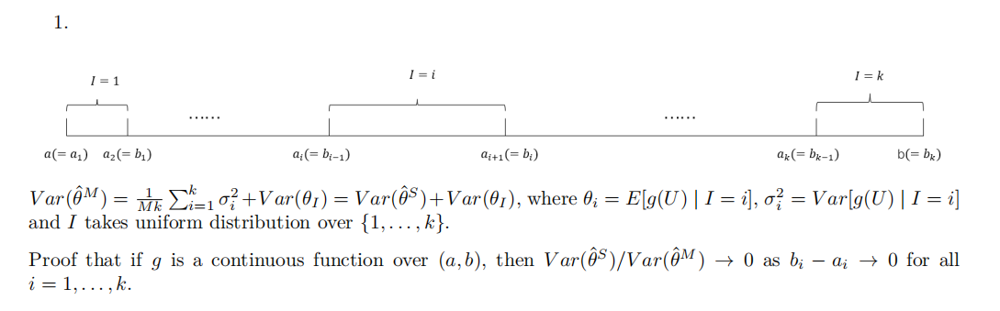

2.

3.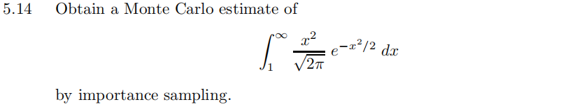

4.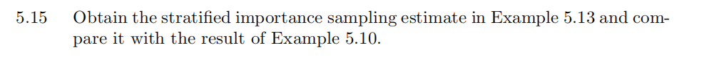

5.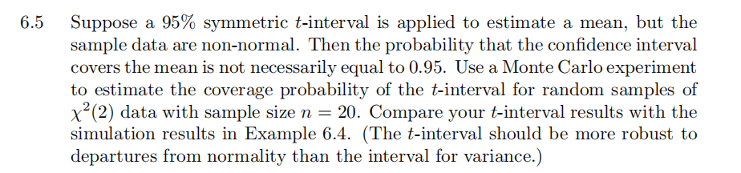

6.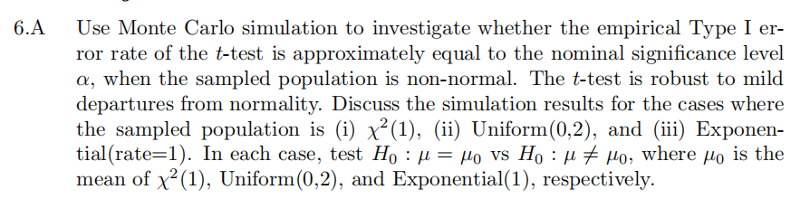

---

## Answer
### Question1

简单估计：$\hat{\theta}^M=\frac{1}{M}\sum_{i=1}^{M}g(u_i),\; u_i \sim U(a,b)$

故$\hat{\theta}^M$的方差为：$var(\hat{\theta}^M)=\frac{1}{M}var(g(u)),\; u\sim U(a,b)$

分层估计：$\hat{\theta}^s=\frac{1}{k}\sum_{i=1}^{k}\hat{\theta}_i$，其中：$\hat{\theta}_j=\frac{1}{m}\sum_{j=1}^{m}g(u_{ji}),\; u_{ji}\sim U(a_j,b_j)$

故$\hat{\theta}^s$的方差为：$var(\hat{\theta}^s)=\frac{1}{Mk}\sum_{i=1}^{k}\sigma_i^2,\; \sigma_i^2=var(g(u_{ji}))$

当$b_j-a_j\rightarrow 0$时，对$\forall x \in [a_j,b_j]$，由泰勒展开式有:$g(x)=g(a_j)+(x-a_j)g^{\prime}(a_j)+o(x-a_j)$，

故$var(g(u_{ji}))=(g^{\prime}(a_j))^2var(u_{ji}-a_j)+o(b_j-a_j)^2$，其中:$u_{ji} \sim U(a_j,b_j)$

计算可得：$var(g(u_{ji}))=(g^{\prime}(a_j))^2*\frac{(b_j-a_j)^2}{12}+o(b_j-a_j)^2$


$$var(\hat{\theta}^s)=\frac{1}{Mk}\sum_{i=1}^{k}(g^{\prime}(a_i))^2*\frac{(b_i-a_i)^2}{12}+o(b_i-a_i)^2$$

$$\frac{var(\hat{\theta}^s)}{var(\hat{\theta}^M)}=\frac{\sum_{i=1}^{k}(g^{\prime}(a_i))^2*\frac{(b_i-a_i)^2}{12}+o(b_i-a_i)^2}{k*var(g(u))}\rightarrow 0\quad as\quad b_i-a_i\rightarrow 0 \quad for\quad all\quad i=1,\ldots,k.$$

### Question2 and 3

我们选择$f_1(x)=\frac{1}{\sqrt{2\pi}}e^{-x^2/2},f_2(x)=e^{-x}$作为importance functions。

```{r}
rm(list = ls())
set.seed(123)

m <- 100000
theta.hat <- se <- numeric(2)
g <- function(x) {
  x^2/sqrt(2*pi)*exp(-x^2/2) * (x > 1)
}

x<-rnorm(m)  #using f1
fg<-g(x)/dnorm(x)
theta.hat[1]<-mean(fg)
se[1]<-sd(fg)/(sqrt(m))

x <- rexp(m, 1) #using f2
fg <- g(x) / exp(-x)
theta.hat[2] <- mean(fg)
se[2] <- sd(fg)/sqrt(m)

plot(1, type = "n", xlab = "",
     ylab = "", xlim = c(1, 10), 
     ylim = c(0, 0.5))
x=seq(from=1, to=10, by=0.01)
lines(x=x,y=g(x),col="black")
lines(x=x,y=dnorm(x),col="red")
lines(x=x,y=exp(-x),col="green")
legend("topright", c("g", "f1","f2"),
       lty = c(1,1,1),
       col = c("black","red", "green"))

plot(1, type = "n", xlab = "",
     ylab = "", xlim = c(1, 10), 
     ylim = c(0, 2))
lines(x=x,y=g(x)/dnorm(x),col="red")
lines(x=x,y=g(x)/exp(-x),col="green")
legend("topright", c("g/f1","g/f2"),
       lty = c(1,1),
       col = c("red", "green"))

```

从图中看，$g/f_2$的值更接近于一个常数，而$g/f_1$的值是随着x增大而增大的。

因此，使用$f_2$作为importance function应该会产生更小的方差，经验结果也证明了这点。

以$f_1$为importance function的估计方法的标准差为：`r se[1]`,积分的估计值为:`r theta.hat[1]`。

以$f_2$为importance function的估计方法的标准差为：`r se[2]`,积分的估计值为:`r theta.hat[2]`。

而积分的理论值为:`r integrate(g, 1,Inf)$value`。

### Question4
```{r}
set.seed(123)
M<-10000
k<-5
r<-M/k
theta<-numeric(k)
var_j<-numeric(k)
g<-function(x){
  exp(-x)/(1+x^2)*(x>0)*(x<1)
}
for(i in 1:k){
  u<-runif(r,(i-1)/k,i/k)
  theta[i]<-mean(g(u))
  var_j[i]<-var(g(u))
}

value_est<-mean(theta)
var_est<-mean(var_j)/M
print(c(value_est,sqrt(var_est)))
```

与例5.10相比，运用分层抽样的方法，得到的估计量为：`r round(value_est,4)`,而理论值为：`r integrate(g,0,1)$value`。
其标准差为：`r sqrt(var_est)*10^4`$*10^{-4}$，
例子5.10中的最小标准差为：`r 0.0970314/sqrt(M)*10^4`$*10^{-4}$，在相同的样本量下，分层抽样法方差更小，分层抽样法具有明显优势。

### Question5
```{r}
set.seed(123)
M<-1000  #实验重复次数
n <- 20
alpha <- .05
cov1<-numeric(M)
cov2<-numeric(M)
for(i in 1:M){
  x <- rchisq(n,2)
  UCL <- (n-1) * var(x) / qchisq(alpha, df=n-1)
  cov1[i]<-4<UCL
  temp_value=abs(sqrt(n)*mean(x-2))/sqrt(var(x))
  cov2[i]<-temp_value<qt(1-alpha/2,n-1)
}
print(c(mean(cov2),mean(cov1)))
```

$t-interval$的平均覆盖率为：`r mean(cov2)`

例6.4中的interval for variance的平均覆盖率为:`r mean(cov1)`

这说明$t-interval$在总体分布偏离正态分布的条件下，相较于interval for variance，具有更好的稳健性。

### Question6
```{r}
set.seed(123)
mu<-1 #null hypothesis
M<-10000
n<-20
p.val1<-numeric(M)
p.val2<-numeric(M)
p.val3<-numeric(M)
for(i in 1:M){
  x1<-rchisq(n,1)
  x2<-runif(n,0,2)
  x3<-rexp(n,1)
  p.val1[i]<-2*(1-pt(abs(sqrt(n)*mean(x1-mu))/sqrt(var(x1)),n-1))
  p.val2[i]<-2*(1-pt(abs(sqrt(n)*mean(x2-mu))/sqrt(var(x2)),n-1))
  p.val3[i]<-2*(1-pt(abs(sqrt(n)*mean(x3-mu))/sqrt(var(x3)),n-1))
}
print(c(mean(p.val1<=0.05),mean(p.val2<=0.05),mean(p.val3<=0.05)))
```

当样本总体来自$\chi^2(1)$时，$t-test$犯1类错误的概率为：`r mean(p.val1<=0.05)`,

当样本总体来自$U(0,2)$时，$t-test$犯1类错误的概率为：`r mean(p.val2<=0.05)`,

当样本总体来自$exp(1)$时，$t-test$犯1类错误的概率为：`r mean(p.val3<=0.05)`。

从该结果可以看出，均匀分布偏离正态分布的程度最轻，指数分布次之，卡方分布最严重。

---

# Homework 5 2023.10.16
## Question
1.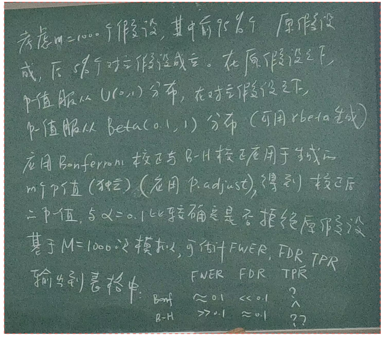

2.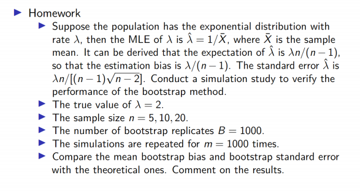

3.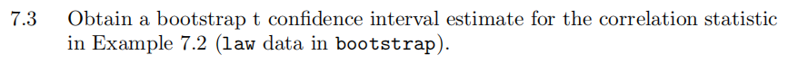


---

## Answer
### Question1
```{r}
rm(list = ls())
set.seed(12345)
m<-1000
m_null<-m*0.95
m_alter<-m*0.05
M<-1000
alpha=0.1
value1<-c(rep(0,times=m_null),rep(1,times=m_alter))   #950个0和50个1，0代表原假设成立，1代表备择假设成立
Bonf_FWER<-numeric(M)
Bonf_FDR<-numeric(M)
Bonf_TPR<-numeric(M)
BH_FWER<-numeric(M)
BH_FDR<-numeric(M)
BH_TPR<-numeric(M)
for(i in 1:M){
  p_value_null<-runif(m_null)  ##原假设成立时的p值
  p_value_alter<-rbeta(m_alter,0.1,1)  ##备择假设成立时的p值
  p_value<-c(p_value_null,p_value_alter) ##全体1000p值
  p_value_Bonf<-p.adjust(p_value,method="bonferroni")
  p_value_BH<-p.adjust(p_value,method = "BH")
  value_Bonf<-ifelse(p_value_Bonf<alpha,1,0)  ##在Bonferroni校正后，1代表拒绝原假设，0代表接受原假设
  value_BH<-ifelse(p_value_BH<alpha,1,0)      ##在B-H校正后，1代表拒绝原假设，0代表接受原假设
  table_Bonf<-table(value_Bonf,value1)        ##table[1,1]为U，table[1,2]为T，table[2,1]为V，table[2,2]为S
  table_BH<-table(value_BH,value1)
  Bonf_FWER[i]<-table_Bonf[2,1]>0
  BH_FWER[i]<-table_BH[2,1]>0
  Bonf_FDR[i]<-table_Bonf[2,1]/(table_Bonf[2,1]+table_Bonf[2,2])
  BH_FDR[i]<-table_BH[2,1]/(table_BH[2,1]+table_BH[2,2])
  Bonf_TPR<-table_Bonf[2,2]/(table_Bonf[1,2]+table_Bonf[2,2])
  BH_TPR<-table_BH[2,2]/(table_Bonf[1,2]+table_BH[2,2])
}
result<-data.frame(method=c("Bonf","B-H"),FWER=c(mean(Bonf_FWER),mean(BH_FWER)),FDR=c(mean(Bonf_FDR),mean(BH_FDR)),TPR=c(mean(Bonf_TPR),mean(BH_TPR)))
print(result)
```

### Question2
```{r}
lambda<-2
B<-1000
bootstrap_exp<-function(n,m,B){
  boot_bias<-numeric(m)
  boot_se<-numeric(m)
  for(i in 1:m){
    x<-rexp(n,lambda)
    theta<-1/mean(x)
    thetastar<-numeric(B)
    for(b in 1:B){
      xstar<-sample(x,replace=TRUE)
      thetastar[b]<-1/mean(xstar)
    }
    boot_bias[i]<-mean(thetastar)-theta
    boot_se[i]<-sd(thetastar)
  }
  c(boot.bias=mean(boot_bias),the.bias=lambda/(n-1),boot.se=mean(boot_se),the.se=lambda*n/((n-1)*sqrt(n-2)))
}
result1=bootstrap_exp(5,m,B)
result2=bootstrap_exp(10,m,B)
result3=bootstrap_exp(20,m,B)
result=data.frame(n=c(5,10,20),boot.bias=c(result1[1],result2[1],result3[1]),
                  the.bias=c(result1[2],result2[2],result3[2]),
                  boot.se=c(result1[3],result2[3],result3[3]),
                  the.se=c(result1[4],result2[4],result3[4]))
print(result)
```

从上表中可以看出，n较小时(n=5)，对bias和sd的估计与理论值相比，都有较大偏差。随着n的增大，当n=20时，bootstrap方法估计的bias和sd的偏差都比较好，与理论值相差不大。

### Question3
```{r}
set.seed(12345)
library(bootstrap)
library(boot)
x1<-cbind(law$LSAT, law$GPA)     ##包含15个样本
x2<-cbind(law82$LSAT, law82$GPA) ##包含82个样本
B<-1000
theta1_star<-numeric(B)
theta2_star<-numeric(B)
se1_star<-numeric(B)
se2_star<-numeric(B)
for(i in 1:B){
  ind1<-sample(c(1:dim(x1)[1]),replace=TRUE)
  ind2<-sample(c(1:dim(x2)[1]),replace=TRUE)
  x1star<-x1[ind1,]
  x2star<-x2[ind2,]
  theta1_star[i]<-cor(x1star[,1],x1star[,2])
  theta2_star[i]<-cor(x2star[,1],x2star[,2])
  theta1_star_second<-numeric(B)
  theta2_star_second<-numeric(B)
  for(j in 1:B){         ##二次抽样
    ind1<-sample(c(1:dim(x1)[1]),replace=TRUE)
    ind2<-sample(c(1:dim(x2)[1]),replace=TRUE)
    x1star_second<-x1star[ind1,]
    x2star_second<-x2star[ind2,]
    theta1_star_second[j]<-cor(x1star_second[,1],x1star_second[,2])
    theta2_star_second[j]<-cor(x2star_second[,1],x2star_second[,2])
  }
  se1_star[i]<-sd(theta1_star_second)
  se2_star[i]<-sd(theta2_star_second)
}
theta1<-cor(law$LSAT, law$GPA)
theta2<-cor(law82$LSAT, law82$GPA)
se1<-sd(theta1_star)
se2<-sd(theta2_star)
quantile_1<-quantile((theta1_star-theta1)/se1_star,c(0.025,0.975))
quantile_2<-quantile((theta2_star-theta2)/se2_star,c(0.025,0.975))
```

law data构造的95% t置信区间为：(`r theta1-quantile_1[2]*se1`,`r theta1-quantile_1[1]*se1`)

law82 data构造的95% t置信区间为：(`r theta2-quantile_2[2]*se2`,`r theta2-quantile_2[1]*se2`)

可以看到，在law data上，95% t置信区间的表现很差，原因是law data样本量较少，只有15个，这就导致在进行bootstr抽样时，抽到重复样本的概率较大，这导致了构造的t置信区间表现较差。


---

# Homework 6 2023.10.23
## Question
1.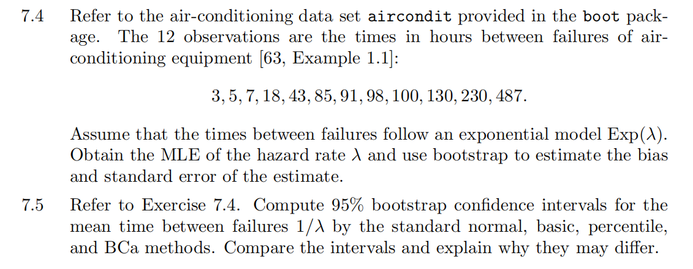

2.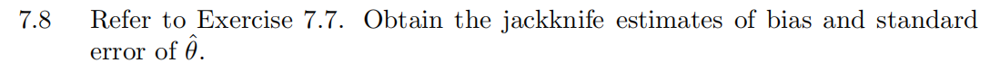

3.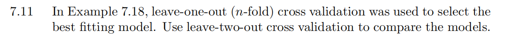

---

## Answer
### Question1
```{r}
library(boot)
rm(list = ls())
set.seed(12345)
m<-1e4
x=c(3, 5, 7, 18, 43, 85, 91, 98, 100, 130, 230, 487)
boot.lambda<-function(x,i) mean(x[i])
ci.norm<-ci.basic<-ci.perc<-ci.bca<-matrix(NA,1,2)
obj <- boot(data=x,statistic=boot.lambda, R = 999)
ci <- boot.ci(obj,type=c("norm","basic","perc","bca"))
ci.norm[1,]<-ci$norm[2:3];ci.basic[1,]<-ci$basic[4:5]
ci.perc[1,]<-ci$percent[4:5];ci.bca[1,]<-ci$bca[4:5]
result<-data.frame(method=c("norm","perc","basic","bca"),lower_bound=c(ci.norm[1],ci.perc[1],ci.basic[1],ci.bca[1]),
                   upper_bound=c(ci.norm[2],ci.perc[2],ci.basic[2],ci.bca[2]))
print(result)
d=density(x)
plot(d)
abline( v = mean(x), col = "blue")
text(mean(x),0.002, "mean(x)", col = "gray60", adj = c(0, -.1))
```

以上四种方法给出的估计区间的长度都为150左右,与另外三种方法相比，bca法构造的置信区间整体右偏，这是因为：从数据的概率密度估计图可以看出，数据右侧存在严重的厚尾分布情况，而bca方法在构造置信区间时考虑了数据的偏度信息，因此在数据存在左偏或右偏时，构造的置信区间应该更有效。
而basic方法与另外三种方法相比，构造的置信区间明显左偏。这是因为在本题中构造置信区间时，basic方法构造的置信区间依赖于数据的均值，而在数据存在左偏或是右偏时，均值不能很好的刻画分布的信息。在本题中，根据均值构造的置信区间，上下限在均值两侧附近,构造的置信区间会相对左偏。

### Question2
```{r}
library(bootstrap)
data(scor)
data<-scor
n<-dim(scor)[1]
ev <- eigen(cov(data))
theta_hat<-ev$val[1]/sum(ev$val)
theta_jack<-numeric(n)
for(i in 1:n){
  data_star<-data[-i,]
  ev <- eigen(cov(data_star))
  theta_jack[i]<-ev$val[1]/sum(ev$val)
}
jack.bias<-(n-1)*(mean(theta_jack)-theta_hat)
jack.var<-(n-1)*var(theta_jack)*(n-1)/n
jack.se<-sqrt(jack.var)
round(c(original=theta_hat,bias.jack=jack.bias,
se.jack=jack.se),3)
```

### Question3
```{r}
library(DAAG); attach(ironslag)
n <- length(magnetic) #in DAAG ironslag
e1 <- e2 <- e3 <- e4 <- numeric(n*(n-1)/2)
# fit models on leave-two-out samples
i=1
for (k in 1:(n-1)) {
  for(j in (k+1):n){
    y <- magnetic[-c(k,j)]
    x <- chemical[-c(k,j)]
    J1 <- lm(y ~ x)
    yhat1 <- J1$coef[1] + J1$coef[2] * chemical[c(k,j)]
    e1[i] <- sum((magnetic[c(k,j)] - yhat1)*(magnetic[c(k,j)] - yhat1))/2
    J2 <- lm(y ~ x + I(x^2))
    yhat2 <- J2$coef[1] + J2$coef[2] * chemical[c(k,j)] +
    J2$coef[3] * chemical[c(k,j)]^2
    e2[i] <- sum((magnetic[c(k,j)] - yhat2)*(magnetic[c(k,j)] - yhat2))/2
    J3 <- lm(log(y) ~ x)
    logyhat3 <- J3$coef[1] + J3$coef[2] * chemical[c(k,j)]
    yhat3 <- exp(logyhat3)
    e3[i] <- sum((magnetic[c(k,j)] - yhat3)*(magnetic[c(k,j)] - yhat3))/2
    J4 <- lm(log(y) ~ log(x))
    logyhat4 <- J4$coef[1] + J4$coef[2] * log(chemical[c(k,j)])
    yhat4 <- exp(logyhat4)
    e4[i] <- sum((magnetic[c(k,j)] - yhat4)*(magnetic[c(k,j)] - yhat4))/2
    i=i+1
  }
}
c(mean(e1),mean(e2),mean(e3),mean(e4))
```

结果表明，使用留一验证与留二验证方法的试验结果差别不大，最后的结果表明，使用Quadratic模型的拟合效果最好。

---

# Homework 7 2023.10.30
## Question
1.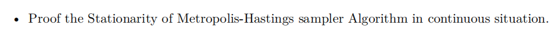

2.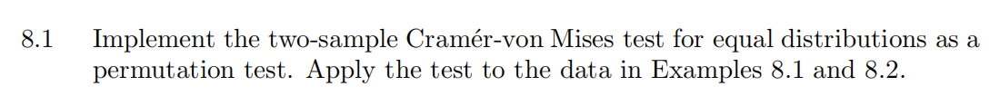

3.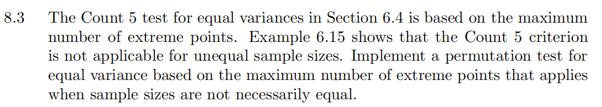

---

## Answer
### Question1
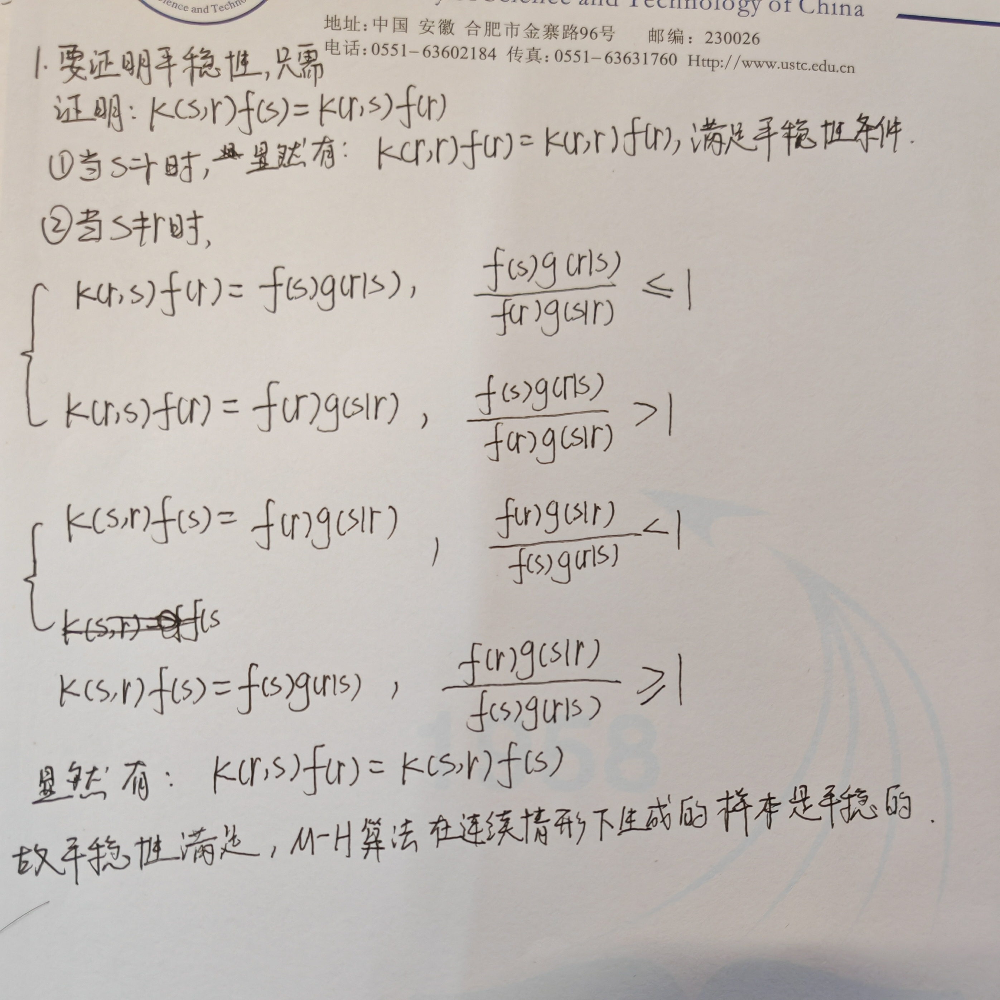
### Question2
```{r}
rm(list = ls())
set.seed(123)
attach(chickwts)
x <- sort(as.vector(weight[feed == "soybean"]))
y <- sort(as.vector(weight[feed == "linseed"]))
detach(chickwts)
R<-999
z<-c(x,y)
n<-length(x)
m<-length(y)
reps<-numeric(R)
F_n<-ecdf(x)
G_m<-ecdf(y)
t0<-m*n/(m+n)^2*(sum((F_n(x)-G_m(x))^2)+sum((F_n(y)-G_m(y))^2))
for(i in 1:R){
  xy<-sample(z)
  x1<-xy[1:n]
  y1<-xy[-(1:n)]
  F_n<-ecdf(x1)
  G_m<-ecdf(y1)
  reps[i]<-m*n/(m+n)^2*(sum((F_n(x1)-G_m(x1))^2)+sum((F_n(y1)-G_m(y1))^2))
}
p<-mean(c(t0,reps)>=t0)
print(p)
```

### Question3
```{r}
set.seed(123)
n1<-20
n2<-50
x<-rnorm(n1,mean=2,sd=1)
y<-rnorm(n2,mean=1,sd=2)
X<-x-mean(x)
Y<-y-mean(y)
R<-999
z<-c(X,Y)
reps<-numeric(R)
outx <- sum(X > max(Y)) + sum(X < min(Y))
outy <- sum(Y > max(X)) + sum(Y < min(X))
t0<-max(c(outx,outy))
for(i in 1:R){
  xy<-sample(z)
  x1<-xy[1:n1]
  y1<-xy[-(1:n1)]
  outx1 <- sum(x1 > max(y1)) + sum(x1 < min(y1))
  outy1 <- sum(y1 > max(x1)) + sum(y1 < min(x1))
  reps[i]<-max(c(outx1,outy1))
}
p<-mean(c(t0,reps)>=t0)
print(p)
```


---

# Homework 8 2023.11.06
## Question
1.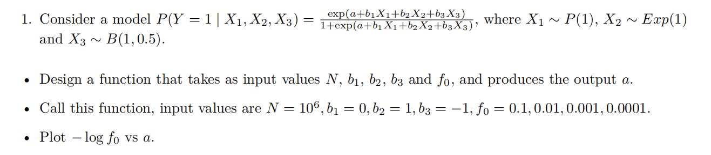

2.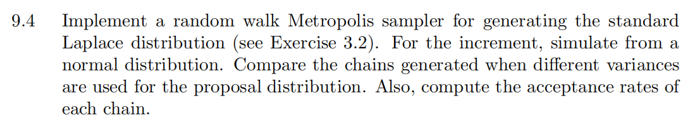

3.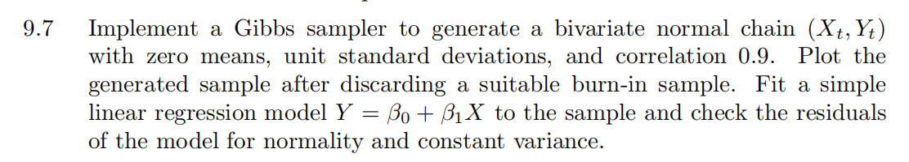

4.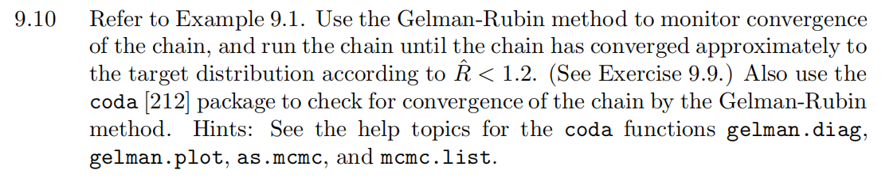


---

## Answer
### Question1
#### 第一问
```{r}
rm(list = ls())
set.seed(123)
output.a<-function(N,b1,b2,b3,f0){
  x1<-rpois(N,lambda=1)
  x2<-rexp(N,rate=1)
  x3<-rbinom(N,1,0.5)
  g<-function(alpha){
    tmp<-exp(-alpha-b1*x1-b2*x2-b3*x3)
    p<-1/(1+tmp)
    mean(p)-f0
  }
  res<-uniroot(g,c(-20,20))[1]
}
```
#### 第二问
```{r}
res1<-output.a(10^6,0,1,-1,0.1)
res2<-output.a(10^6,0,1,-1,0.01)
res3<-output.a(10^6,0,1,-1,0.001)
res4<-output.a(10^6,0,1,-1,0.0001)
```
#### 第二问
```{r}
plot(x=c(res1,res2,res3,res4),y=-log(c(0.1,0.01,0.001,0.0001)),
     xlab="a",ylab="-logf0")
```

### Question2
```{r}
set.seed(12345)
dlaplace<-function(x) 1/2*exp(-abs(x))
rw.MH<-function(sigma,x0,N){
  x<-numeric(N)
  x1<-x0
  acc.rate<-0
  for(i in 2:N){
    y<-rnorm(1,x[i-1],sigma)
    u<-runif(1)
    if(u<=dlaplace(y)/dlaplace(x[i-1])){
      x[i]<-y
      acc.rate<-acc.rate+1
    }
    else
      x[i]<-x[i-1]
  }
  return(list(x=x,acc.rate=acc.rate/N))
}
N<-5000
sigma<-c(0.05,0.5,2,10)
x0<-10
rw1<-rw.MH(sigma[1],x0,N)
rw2<-rw.MH(sigma[2],x0,N)
rw3<-rw.MH(sigma[3],x0,N)
rw4<-rw.MH(sigma[4],x0,N)
rw<-cbind(rw1$x,rw2$x,rw3$x,rw4$x)
for(j in 1:4){
  plot(rw[,j],type="l",xlab=bquote(sigma==.(round(sigma[j],3))),
  ylab="x",ylim=range(rw[,j]))
}
```

在方差sigma=`r sigma`时，其对应的接受率为：`r c(rw1$acc.rate,rw2$acc.rate,rw3$acc.rate,rw4$acc.rate)`。
从图像上看，sigma=2时，构造的链相对较优，去掉前1000个样本作为预烧期，检验生成随机数与标准laplace分布的差异。

```{r}
hist(rw3$x,breaks =100,freq=F,xlab=bquote(sigma==2))
x=seq(-6,6,0.01)
lines(x,dlaplace(x))
```

### Question3
```{r}
set.seed(12345)
N<-5000
x<-matrix(0,N,2)
rho<-0.9
mu1<-mu2<-0
sigma1<-sigma2<-1
sigma1_new<-sqrt(1-rho^2)*sigma1
sigma2_new<-sqrt(1-rho^2)*sigma2
x[1,]<-c(10,10)
for(i in 2:N){
  x2<-x[i-1,2]
  mu1_new<-mu1+rho*sigma1/sigma2*(x2-mu2)
  x1<-x[i,1]<-rnorm(1,mu1_new,sigma1_new)
  mu2_new<-mu2+rho*sigma2/sigma1*(x1-mu1)
  x[i,2]<-rnorm(1,mu2_new,sigma2_new)
}
burn_in<-1000
res<-x[(burn_in+1):N,]
plot(res,xlab="X",ylab="Y",cex=0.4)
```

拟合一个简单线性回归模型：
```{r}
X<-res[,1]
Y<-res[,2]
lm.model<-lm(Y~X)
residuals <- residuals (lm.model)
a<-ppoints(100)
QR<-qnorm(a,mean=0,sd=sigma2_new) ##残差的理论分布
Q<-quantile(X,a)
qqplot(QR,Q,xlab="理论正态分布分位数",ylab="样本残差分位数")
plot(X,residuals)
```

从左图可以看出，回归残差的正态性是满足的；从右图中可以看出，回归残差的大小与协变量X的大小有关，总体上呈现这样一种趋势：X绝对值越小，回归残差的绝对值越大。

### Question4
```{r}
set.seed(12345)
f <- function(x, sigma) {
  if (any(x < 0)) return (0)
  stopifnot(sigma > 0)
  return((x / sigma^2) * exp(-x^2 / (2*sigma^2)))
}
generate.chain<-function(m,x0,sigma){
  x <- numeric(m)
  x[1] <- x0
  u <- runif(m)
  for (i in 2:m) {
    xt <- x[i-1]
    y <- rchisq(1, df = xt)
    num <- f(y, sigma) * dchisq(xt, df = y)
    den <- f(xt, sigma) * dchisq(y, df = xt)
    if (u[i] <= num/den) x[i] <- y else {
      x[i] <- xt
    }
  }
  return(x)
}
Gelman.Rubin <- function(psi) {
  # psi[i,j] is the statistic psi(X[i,1:j])
  # for chain in i-th row of X
  psi <- as.matrix(psi)
  n <- ncol(psi)
  k <- nrow(psi)
  psi.means <- rowMeans(psi) #row means
  B <- n * var(psi.means) #between variance est.
  psi.w <- apply(psi, 1, "var") #within variances
  W <- mean(psi.w) #within est.
  v.hat <- W*(n-1)/n + (B/n) #upper variance est.
  r.hat <- v.hat / W #G-R statistic
  return(r.hat)
}

m <- 10000
sigma <- 4
x0<-c(1,5,10,20)
X<-matrix(0,nrow=4,ncol=m)
for(i in 1:4){
  X[i,]<-generate.chain(m,x0[i],sigma)
}

psi<-t(apply(X,1,cumsum))
for (i in 1:nrow(psi)){
  psi[i,]<-psi[i,]/(1:ncol(psi))
}
print(Gelman.Rubin(psi))
rhat<-rep(0,m)
b<-1000
for(j in (b+1):m){
  rhat[j]<-Gelman.Rubin(psi[,1:j])
}
plot(rhat[(b+1):m],type="l",xlab="",ylab="R_hat")
abline(h=1.2,lty=2)
```

```{r}
library(coda)
res=mcmc.list(mcmc(X[1,]),mcmc(X[2,]),mcmc(X[3,]),mcmc(X[4,]))
gelman.diag(res)
gelman.plot(res)
```


---

# Homework 9 2023.11.13
## Question
1.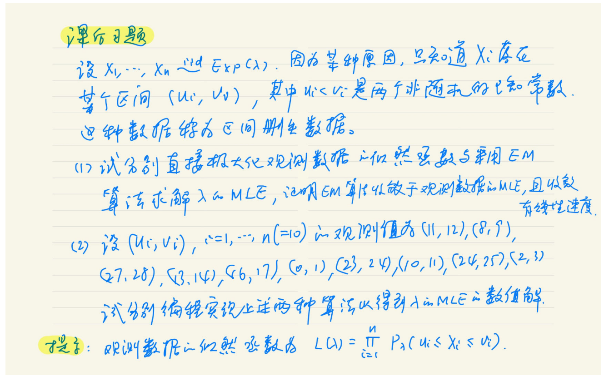

2.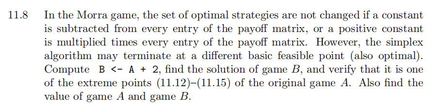

---

## Answer
### Question1
#### 第一问

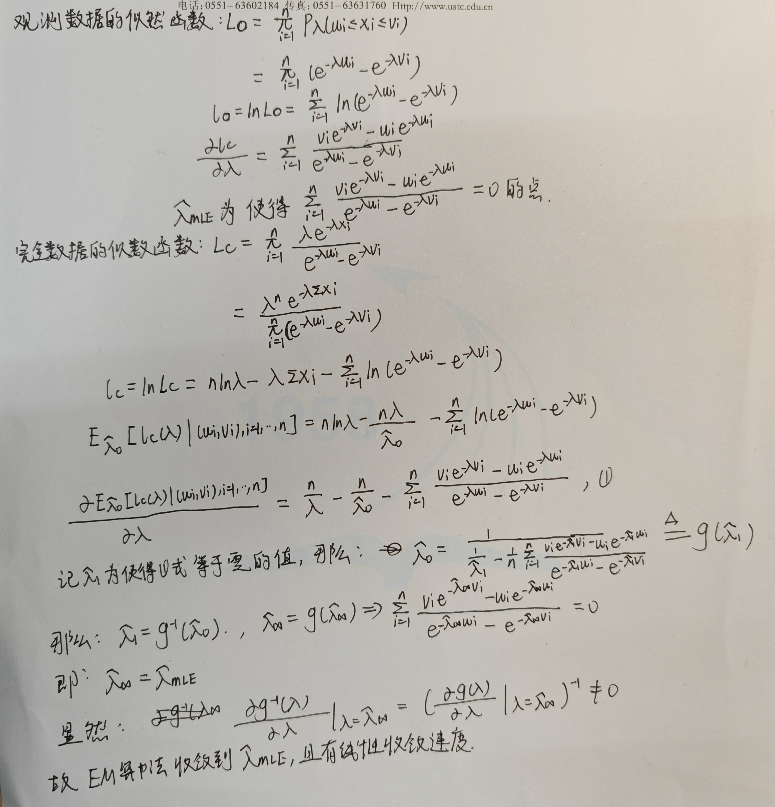

#### 第二问
```{r}
rm(list = ls())
u<-c(11,8,27,13,16,0,23,10,24,2)
v<-c(12,9,28,14,17,1,24,11,25,3)
f<-function(x){
  res=0
  for(i in 1:length(u)){
    res=res+(v[i]-u[i]*exp(-x*(u[i]-v[i])))/(exp(-x*(u[i])-v[i])-1)
  }
  return(res)
}

lambda_mle<-uniroot(f,c(0,1))$root  ###lambda的极大似然估计

g<-function(x1,x0){
  n/x1-n
}

EM<-function(max.it=10000,eps=1e-5){
  n<-length(v)
  lambda_0=1
  lambda_1=2
  while(abs(lambda_1-lambda_0)>eps){
    g<-function(x) n/x-n/lambda_0-f(x)
    lambda_0<-lambda_1
    lambda_1<-uniroot(g,c(0,1))$root
  }
  return(lambda_1)
}
lambda_em<-EM()  ###EM算法得到lambda的估计
```

$\lambda$的极大似然估计$\lambda_{mle}$为:`r lambda_mle`，而使用EM算法得到的估计$\lambda_{em}$为：`r lambda_em`。可以看出，EM算法得到的$\lambda_{em}$的是收敛到$\lambda_{mle}$的。

```{r}
set.seed(12345)
A <- matrix(c( 0,-2,-2,3,0,0,4,0,0,
              2,0,0,0,-3,-3,4,0,0,
              2,0,0,3,0,0,0,-4,-4,
              -3,0,-3,0,4,0,0,5,0,
              0,3,0,-4,0,-4,0,5,0,
              0,3,0,0,4,0,-5,0,-5,
              -4,-4,0,0,0,5,0,0,6,
              0,0,4,-5,-5,0,0,0,6,
              0,0,4,0,0,5,-6,-6,0), 9, 9)
B<-A+2

solve.game <- function(A) {
  #solve the two player zero-sum game by simplex method
  #optimize for player 1, then player 2
  #maximize v subject to ...
  #let x strategies 1:m, and put v as extra variable
  #A1, the <= constraints
  #
  min.A <- min(A)
  A <- A - min.A #so that v >= 0
  max.A <- max(A)
  A <- A / max(A)
  m <- nrow(A)
  n <- ncol(A)
  it <- n^3
  a <- c(rep(0, m), 1) #objective function
  A1 <- -cbind(t(A), rep(-1, n)) #constraints <=
  b1 <- rep(0, n)
  A3 <- t(as.matrix(c(rep(1, m), 0))) #constraints sum(x)=1
  b3 <- 1
  sx <- simplex(a=a, A1=A1, b1=b1, A3=A3, b3=b3,
  maxi=TRUE, n.iter=it)
  #the ’solution’ is [x1,x2,...,xm | value of game]
  #
  #minimize v subject to ...
  #let y strategies 1:n, with v as extra variable
  a <- c(rep(0, n), 1) #objective function
  A1 <- cbind(A, rep(-1, m)) #constraints <=
  b1 <- rep(0, m)
  A3 <- t(as.matrix(c(rep(1, n), 0))) #constraints sum(y)=1
  b3 <- 1
  sy <- simplex(a=a, A1=A1, b1=b1, A3=A3, b3=b3,
  maxi=FALSE, n.iter=it)
  soln <- list("A" = A * max.A + min.A,
  "x" = sx$soln[1:m],
  "y" = sy$soln[1:n],
  "v" = sx$soln[m+1] * max.A + min.A)
  soln
}

library(boot) #needed for simplex function
s <- solve.game(B)
round(cbind(s$x,s$y),7)
cat("The value of game A:",t(s$x)%*%A%*%s$y,"\n")
cat("The value of game B:",t(s$x)%*%B%*%s$y,"\n")
```


---

# Homework 10 2023.11.20
### 1

## Question
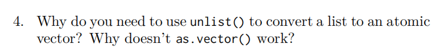

## Answer

举一个例子:

```{r}
x <- list(list(1, 2), c(3, 4),c("a","b","c","d"),"e","f")
unlist(x)
as.vector(x)
```

可以看到，unlist函数是将list结构中的每个子项中的所有元素提取出来再拼接在一起，即便list中嵌套有list，unilist函数也会对嵌套的子list进行上述操作，从而实现list的扁平化;

而as.vector函数是将list结构中的每一个子项转换为一个向量，若lisi中嵌套有子list，则会对子list也重复上述操作，最终得到的结果与原list相同。

产生上述结果的原因是，unlist的操作对象是list结构中每个子项下的元素，而as.vector的操作对象是list结构中的每个子项。

---

## Question 


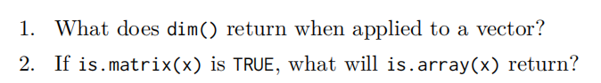

## Answer
```{r}
a<-c(1,2,3,4,5,6,7,8,9)
dim(a)

b<-matrix(data=c(1:6),nrow=2,ncol=3)
cat(c(is.matrix(b),is.array(b)))
```

---

## Question 


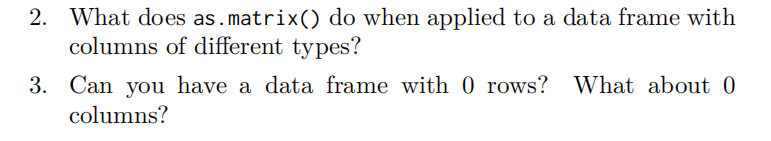

## Answer
```{r}
df<-data.frame(a=c(1,2,3),b=c("a","b","c"),c=c(T,T,F))
as.matrix(df)

df[-c(1,2,3),]  ##0行
df[,-c(1,2,3)]  ##0列
```

---

## Question 


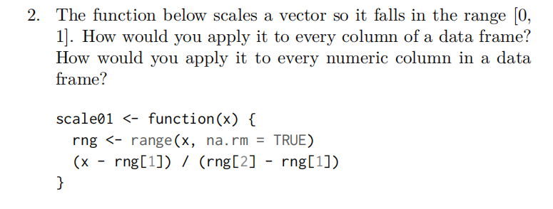

## Answer
```{r}
scale01 <- function(x) {
  rng <- range(x, na.rm = TRUE)
  (x - rng[1]) / (rng[2] - rng[1])
}
##对所有列使用scale01函数
df1<-data.frame(replicate(6,sample(c(1:10,NA),10,rep=T)))
sapply(df1,scale01)


##仅对数值列使用scale01函数
scale01_numeric <- function(x) {
  if(class(x)!="numeric") return(x)
  else return(scale01(x))
}
df2<-data.frame(a=c(1,2,3),b=c("a","b","c"),c=c(T,T,F),d=c(4,8,10))
sapply(df2,scale01_numeric)
```

---

## Question 


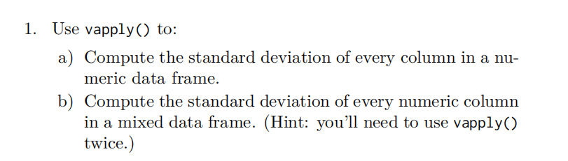

## Answer

```{r}
df1<-data.frame(replicate(6,sample(c(1:10,NA),10,rep=T)))
my_sd<-function(x){
  funcs<-c(sd)
  sapply(funcs,function(f) f(x, na.rm = TRUE))
}
vapply(df1,my_sd,FUN.VALUE = c(sd=0))

df2<-data.frame(a=c(1,2,3),b=c("a","b","c"),c=c(T,T,F),d=c(6,8,10))
my_sd_numeric<-function(x){
  if(class(x)=="numeric"){
    funcs<-c(sd)
    return(sapply(funcs,function(f) f(x, na.rm = TRUE)))
  }
  else{
    return(0)
  }
}
vapply(df2,my_sd_numeric,FUN.VALUE = c(sd=0))
```

---
## 2

## Question 


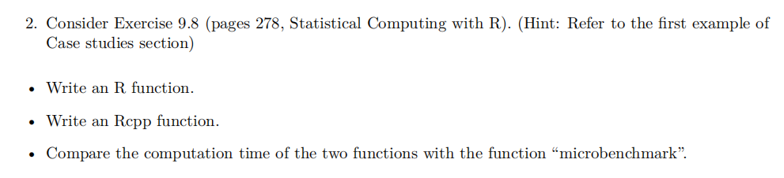
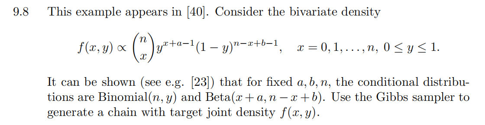

## Answer

R function
```{r}
gen_r<-function(a=1,b=2,n=5000){
  res<-matrix(data=NA,nrow=n,ncol=2)
  res[1,]<-c(n/2,0.5)
  for(i in 2:n){
    y<-res[i-1,2]
    x<-rbinom(1,n,y)
    res[i,1]<-x
    y<-rbeta(1,x+a,n-x+b)
    res[i,2]<-y
  }
  return(res)
}
```


Rcpp function
* C++ function **gen_Rcpp.cpp**
```{r,eval=FALSE}
#include <Rcpp.h>
#include <iostream>
#include <random>
using namespace Rcpp;
using namespace std;
// [[Rcpp::export]]
NumericMatrix gen_Rcpp(double a=1,double b=2,int n=5000) {
  NumericMatrix res(n,2);
  NumericVector x(n);
  NumericVector y(n);
  x[0]=n/2;
  y[0]=0.5;
	double ytemp=0;
	int xtemp=0;
	for(int i = 1; i < n; ++i) {
	ytemp=y[i-1];
	std::default_random_engine generator;
	std::binomial_distribution<int> distribution(n,ytemp);
	xtemp=distribution(generator);
	x[i]=xtemp;
	ytemp=std::beta(xtemp+a,n-xtemp+b);
	y[i]=ytemp;
	}
	res(_,0)=x;
	res(_,1)=y;
	return res;
}
```

```{r}
library(Rcpp)
library(microbenchmark)
sourceCpp(paste0("C:/Users/Billy/Desktop/统计计算/作业/作业10/","gen_Rcpp.cpp"))
ts <- microbenchmark(r_time=gen_r(),rcpp_time=gen_Rcpp())
summary(ts)
```